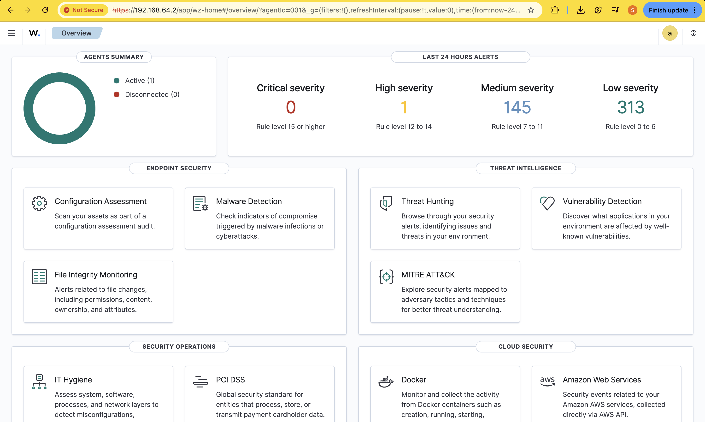
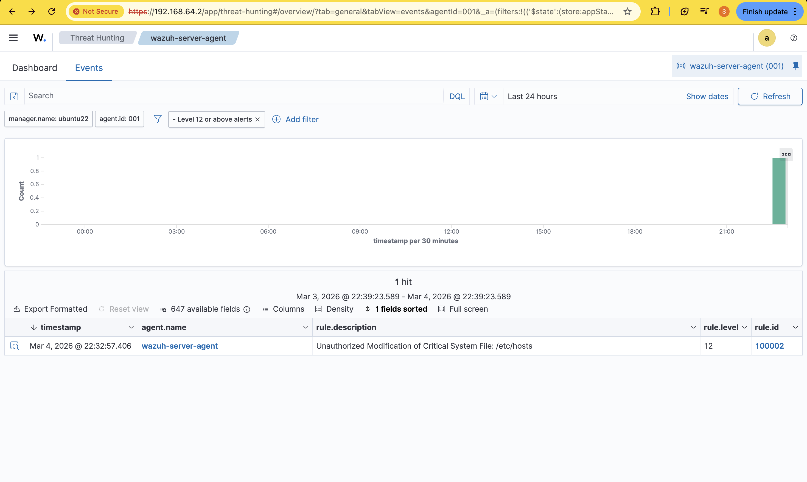
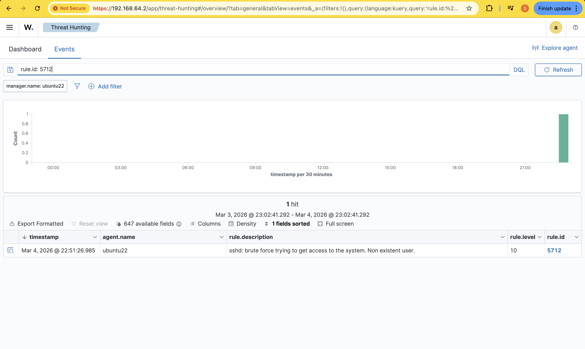
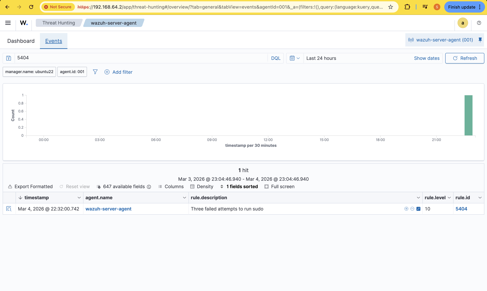
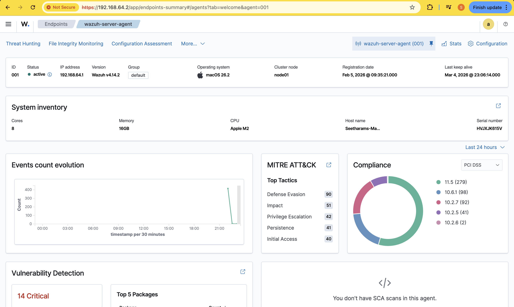
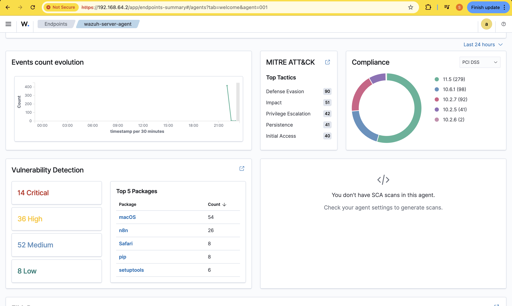
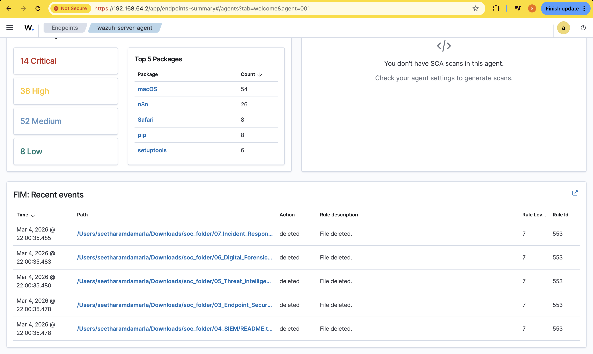
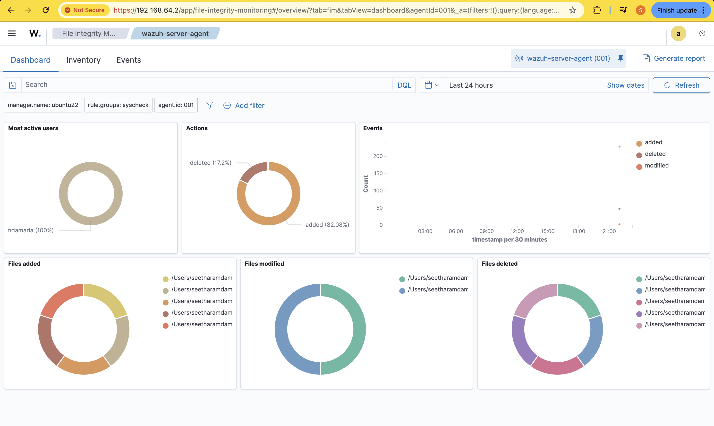
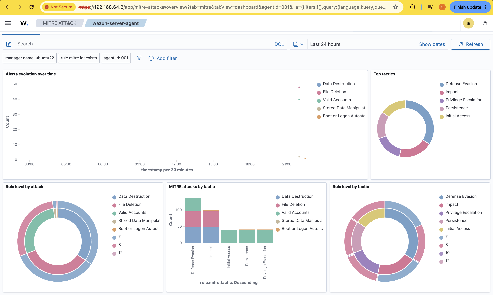
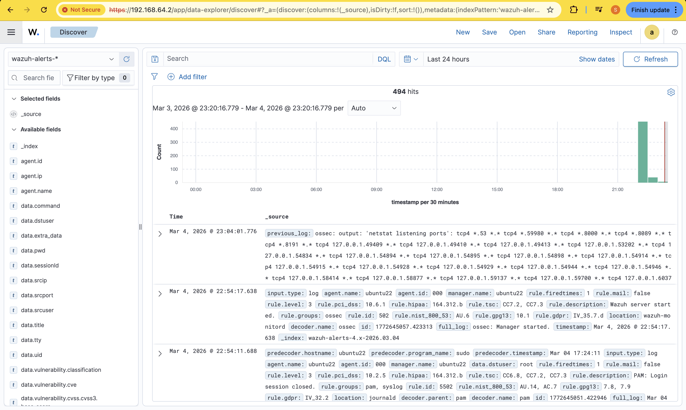

# SentinelSIEM: Advanced SOC & Threat Detection Lab


> A production-grade Security Operations Center (SOC) monitoring environment built on **Wazuh SIEM**, demonstrating real-world blue-team detection engineering, threat intelligence integration, and incident response workflows.

---

## Project Overview

SentinelSIEM is a comprehensive SIEM lab that simulates a real SOC environment. Built on **Wazuh** (deployed on Ubuntu Server 22.04) with a **macOS Apple M2** endpoint, this project showcases advanced blue-team capabilities including custom detection engineering, file integrity monitoring, vulnerability scanning, and attack simulations mapped to the **MITRE ATT&CK®** framework.

### Infrastructure
- **SIEM Server:** Ubuntu Server 22.04 — Wazuh Manager + Indexer + Dashboard
- **Monitored Endpoint:** macOS (Apple M2, 16GB RAM) — Wazuh Agent v4.14.2
- **Connection:** Secure TLS agent-to-manager communication

---

## Live Dashboard — Security Events Overview


*419 total alerts across 24 hours — macOS endpoint actively monitored with alert frequency, FIM events, and authentication tracking visible.*

---

## Architecture

```
┌─────────────────────────────────┐     TLS (Port 1514)    ┌──────────────────────────┐
│   macOS Endpoint (Apple M2)     │ ─────────────────────► │  Ubuntu Server 22.04     │
│   Wazuh Agent v4.14.2           │                        │  Wazuh Manager           │
│   - Auth Logs (authd)           │                        │  Wazuh Indexer           │
│   - File Integrity (syscheck)   │                        │  Wazuh Dashboard         │
│   - FIM: /etc/hosts, /etc/passwd│                        │  Custom Rules Engine     │
│   - LaunchDaemons/Agents        │                        │                          │
└─────────────────────────────────┘                        └──────────────────────────┘
                                                                        │
                                                                        ▼
                                                           ┌─────────────────────────┐
                                                           │  Threat Intelligence    │
                                                           │  CDB List: malicious_ips│
                                                           │  IOC Matching Engine    │
                                                           └─────────────────────────┘
```

See [Architecture Document](docs/ARCHITECTURE.md) for a detailed Mermaid diagram.

---

## Detection Engineering

Custom Wazuh rules in `rules/custom_detections.xml` mapped to MITRE ATT&CK:

| Rule ID | Level | Description | MITRE Technique |
|---------|-------|-------------|-----------------|
| 100001 | 10 | SSH Brute Force — Existing User | T1110.001 |
| 100002 | 12 | Unauthorized File Modification (FIM) | T1547, T1565 |
| 100003 | 08 | New macOS User Account Created | T1078, T1136.001 |
| 100004 | 11 | Privilege Escalation — Failed Sudo | T1068 |
| 100005 | 09 | Suspicious Payload Download | T1105, T1059.004 |
| 100006 | 14 | Threat Intel IOC Match (Malicious IP) | T1071 |
| 100007 | 10 | SSH Brute Force — Non-Existent User | T1110.003 |

### Alert Severity Classification
```
🟢 LOW    (Level 1-4)   → Informational events
🟡 MEDIUM (Level 5-7)   → Suspicious activity
🟠 HIGH   (Level 8-11)  → Potential attack
🔴 CRITICAL (Level 12+) → Confirmed malicious behavior
```

---

## Live Alert Evidence

### Critical Alert: Unauthorized File Modification (Rule 100002 — Level 12)

*Custom rule 100002 triggered when `/etc/hosts` was tampered with. Classified as CRITICAL (Level 12).*

### Brute Force Attack Detected (Rule 5712 — Level 10)

*8 rapid SSH attempts from macOS to Ubuntu server detected as brute force. MITRE T1110.*

### Privilege Escalation Detected (Rule 5404 — Level 10)

*Three failed sudo authentication attempts identified as privilege escalation attempt. MITRE T1068.*

---

## macOS Endpoint Monitoring


*Full macOS endpoint summary — Apple M2, 16GB RAM, active MITRE ATT&CK tactic mapping showing Privilege Escalation (42), Initial Access (40), and Persistence (41) events.*

---

## Vulnerability Detection


*Wazuh vulnerability scanner identified 14 Critical, 36 High, 52 Medium, and 8 Low CVEs on the macOS endpoint — demonstrating automated vulnerability management.*

---

## File Integrity Monitoring

### FIM Event Stream

*Real-time file modification, addition, and deletion events tracked on the macOS endpoint.*

### FIM Dashboard Overview

*FIM dashboard showing 82% file additions and 17.2% deletions — event spike visible at time of attack simulation.*

---

## MITRE ATT&CK Coverage


*MITRE ATT&CK dashboard showing detected tactics: Defense Evasion (dominant), Impact, Initial Access, Persistence, and Privilege Escalation — all triggered by real activity on the monitored endpoint.*

---

## Raw Log Analysis (Threat Hunting)


*OpenSearch Discover view showing 494 indexed log documents with full field enrichment including PCI DSS, HIPAA, and NIST 800-53 compliance tags auto-mapped.*

---

## Attack Simulations

Controlled attack scenarios were executed to validate SIEM detection capability. See [Attack Guide](simulations/attack_guide.md).

| Attack | Command | Rule Triggered | Level |
|--------|---------|----------------|-------|
| Brute Force SSH | `for i in {1..8}; do ssh fakeuser@server; done` | 5712 | 10 |
| FIM Tampering | `echo "test" \| sudo tee -a /etc/hosts` | 100002 | 12 |
| Privilege Escalation | `sudo -k && sudo ls /var/root` (wrong pwd ×3) | 5404 | 10 |
| New User Creation | `sudo sysadminctl -addUser rogue_admin` | 100003 | 8 |

---

## SOC Investigation Workflow

A structured analyst workflow is documented in [SOC Workflow](docs/SOC_WORKFLOW.md):

```
Alert Generated (SIEM Rule Fires)
         ↓
    Alert Triage (Severity/MITRE check)
         ↓
    Log Analysis (Raw JSON review, IOC extraction)
         ↓
    Timeline Investigation (±15 min context)
         ↓
    Incident Confirmation (TP vs FP determination)
         ↓
    Escalation & Containment (Active Response / IR handoff)
```

---

## Threat Hunting Queries

KQL queries for proactive threat hunting are documented in [Threat Hunting Guide](docs/THREAT_HUNTING.md):

- **Low & Slow Password Spraying** — Cross-day auth failure correlation
- **LOLBin Detection** — Hunting `curl`, `base64 -d`, and reverse shells
- **Persistence Hunting** — LaunchDaemon/LaunchAgent new `.plist` tracking
- **Off-Hours Authentication** — Heatmap for abnormal login times

---

## Repository Structure

```
SentinelSIEM/
├── README.md
├── docs/
│   ├── ARCHITECTURE.md       # System architecture + Mermaid diagram
│   ├── SOC_WORKFLOW.md       # Analyst triage & investigation playbook
│   └── THREAT_HUNTING.md     # KQL hunting queries & scenarios
├── rules/
│   └── custom_detections.xml # 7 custom Wazuh rules (MITRE mapped)
├── simulations/
│   └── attack_guide.md       # Step-by-step attack execution guide
├── dashboards/
│   └── DASHBOARD_GUIDE.md    # Dashboard configs, KQL queries & setup guide
└── assets/                   # 10 dashboard screenshots (live evidence)
```

---

## Tech Stack

| Component | Technology |
|-----------|-----------|
| SIEM Platform | Wazuh v4.14.2 |
| Search Engine | OpenSearch (Wazuh Indexer) |
| Dashboard | OpenSearch Dashboards |
| Server OS | Ubuntu Server 22.04 LTS |
| Endpoint OS | macOS (Apple M2) |
| Rule Format | OSSEC XML |
| Query Language | KQL / DQL |
| Framework | MITRE ATT&CK® |

---

## Disclaimer

This project is built entirely for **educational and portfolio purposes**. All attack simulations were executed in an isolated, authorized lab environment. Do not run these simulations on unauthorized systems.

---

*Built by Seetharamdamarla | Blue Team Detection Engineering | SOC Operations*
