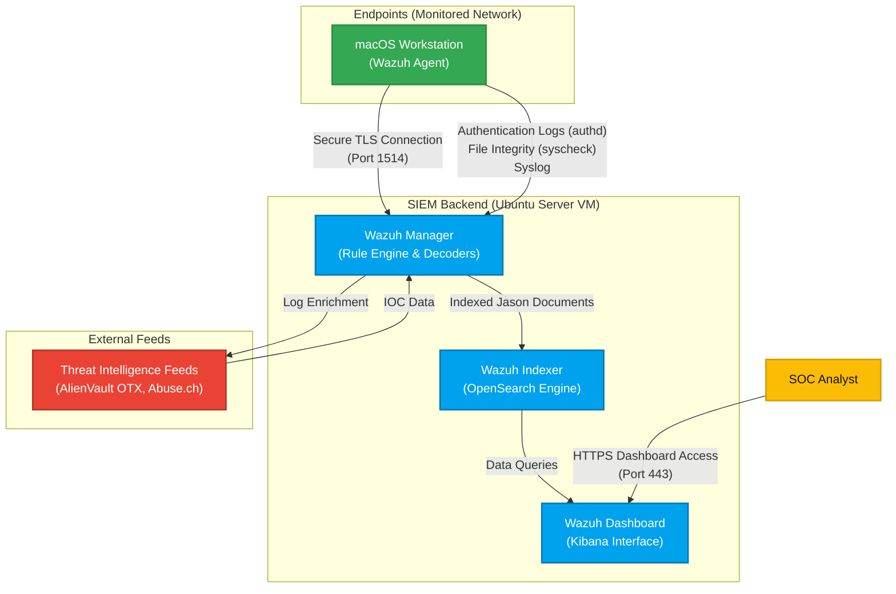

# SentinelSIEM Architecture

This document outlines the architecture of the SentinelSIEM environment, which consists of a centralized SIEM infrastructure and an endpoint agent continuously forwarding security events.

## Logical Architecture Diagram

## Component Details

### 1. The SIEM Backend (Wazuh Manager on Ubuntu)
The SOC "Brain". It receives events from the agent, decodes them, and evaluates them against custom rules and built-in rulesets.
- **Wazuh Indexer:** A highly scalable, full-text search and analytics engine. This component stores the log data as JSON documents.
- **Wazuh Dashboard:** The web user interface where the SOC Analyst performs threat hunting, alert triage, and visualizes security events.
- **Threat Intelligence Integrations:** Using Wazuh's CDB lists and native Virustotal/AlienVault integrations, extracted IPs and file hashes are compared against known malicious lists.

### 2. The Endpoint (macOS Wazuh Agent)
The Wazuh agent runs as a background service on the macOS machine. It periodically collects and forwards:
- **Authentication Logs:** Failed SSH attempts, local graphical logins, and `su` commands.
- **File Integrity Monitoring (FIM):** The `syscheck` module creates cryptographic baselines of critical files (`/etc/passwd`, `/etc/shadow`, `/etc/hosts`).
- **Command Executions:** Capturing bash history or auditd equivalents to monitor what software is executed.
